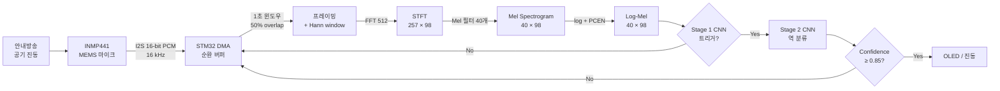
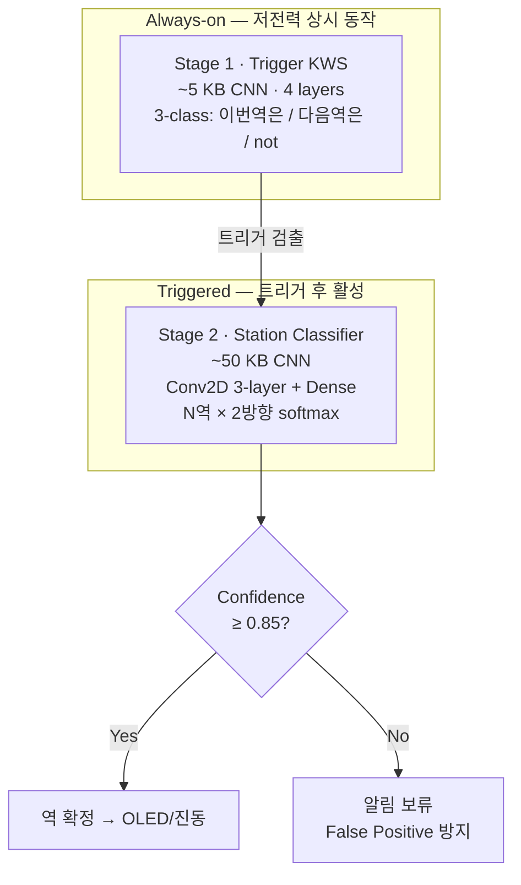
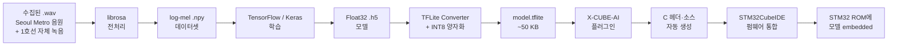

# Hey now!

> 지하철 안내방송 기반 하차역 알림 시스템 — **임베디드시스템설계 기말 프로젝트** (성균관대학교)

GPS·WiFi가 닿지 않는 지하 환경에서, STM32 F411RE 보드가 차내 안내방송("이번 역은 ~~역입니다")을 TinyML로 인식해 현재 위치와 하차역을 알려주는 시스템입니다. 제품 모델명은 **Hey now!** — 놓친 안내방송을 디바이스가 대신 잡아 사용자의 주의를 환기시킨다는 의미.

## 동기

- 한국 지하철은 깊고, GPS/셀룰러/WiFi 위치 측정이 부정확한 구간이 많음
- **청각장애인**은 안내방송을 들을 수 없고, **에어팟·이어폰을 낀 사용자**도 음악·통화·집중으로 안내를 놓침
- 기존 청각장애 보조기기(Apple Sound Recognition, Neosensory, Lumename, SSIES 등)는 사이렌·알람 같은 위험음에만 집중하고 **지하철 안내방송 시나리오는 빈 칸**
- 안내방송은 환경에 이미 존재하는 위치 신호 — 별도 인프라 없이 활용 가능

## 데모 시나리오

1. **공식 음원 재생 테스트** — Seoul Metro 공식 안내방송을 보드 마이크로 입력, OLED에 현재 역 표시
2. **실차 잡음 강건성** — 1호선 차내 녹음(혼잡 시간대 포함)으로 SNR 강건성 시연
3. **하차 알림** — 사용자가 등록한 하차역 도착 직전 진동 알림

## 시스템 구성

```
[INMP441 마이크] ──I2S──> [STM32 F411RE] ──> [OLED / 진동모터]
                              │
                              ├── CMSIS-DSP (MFCC, VAD)
                              ├── Stage 1: 트리거 KWS  (~5KB)
                              └── Stage 2: 역 분류 CNN (~50KB)
```

### 2-Stage 모델 구조

- **Stage 1 (Always-on)**: "이번 역은 / 다음 역은" 트리거 검출
- **Stage 2 (Triggered)**: 직후 2~3초 안에 등장하는 역 이름 분류
- Confidence threshold로 잘못된 알림(false positive) 억제

## 구현 방법 (Implementation Pipeline)

소리가 STM32 안에서 "이번 역은 OO역"으로 분류되기까지의 신호 흐름을 단계별로 설명합니다.

### 1. 전체 신호 흐름



### 2. KWS란 — Keyword Spotting의 위치

KWS는 ASR(전체 음성 인식)의 축소판이 아니라, **별도의 경량 분야**입니다.

| | ASR (전체 음성 인식) | **KWS (Keyword Spotting)** |
|---|---|---|
| 목적 | 모든 발화를 텍스트로 | **정해진 단어/구간만 감지** |
| 모델 크기 | 수백 MB ~ GB | **수십 KB ~ 수 MB** |
| 추론 지연 | 수백 ms ~ 초 | **수십 ms** |
| 대표 예 | Whisper, Google STT | "헤이 시리", "오케이 구글" |
| 우리 사용 | ❌ STM32 한계 초과 | ✅ 정형 안내방송에 최적 |

> **핵심 인사이트**: 지하철 안내방송은 어휘가 한정되고 패턴이 정형이라, ASR을 풀로 돌릴 필요 없이 KWS만으로 충분히 풀린다. 이것이 STM32 위에서 동작 가능한 결정적 이유.

### 3. 음성 신호의 단계별 변환

#### 3.1 마이크 캡처 (I2S)

| | |
|---|---|
| **입력** | 공기 진동 (아날로그) |
| **처리** | MEMS 다이어프램 → ΔΣ ADC → I2S 디지털 송출 |
| **출력** | 16-bit PCM, 16 kHz 샘플링 |
| **WHY** | 음성 대역 대부분이 8 kHz 이하 → Nyquist 정리로 16 kHz면 충분 |

#### 3.2 프레이밍 + 윈도잉

| | |
|---|---|
| **입력** | 연속 PCM 스트림 |
| **처리** | 1초 윈도우(16,000 샘플) 안에서 **25 ms 짧은 프레임(400 샘플)** 으로 분할, **10 ms씩 슬라이드** → 1초당 약 98 프레임. 각 프레임에 Hann window 곱함 |
| **출력** | 98 × 400 행렬 |
| **WHY** | 음성은 시간에 따라 변하는 비정상(non-stationary) 신호. 짧은 구간에서만 정상으로 근사 가능 → 그 단위로 분석해야 주파수 정보가 안정적 |

#### 3.3 STFT (Short-Time Fourier Transform)

| | |
|---|---|
| **입력** | 98개 프레임 (각 400 샘플) |
| **처리** | 프레임별 FFT 512-point (zero-padding) → 크기(magnitude) 취함 |
| **출력** | 257 × 98 magnitude spectrogram |
| **WHY** | 시간 영역(파형)으로는 음소 구분 어려움. 주파수 영역에서는 모음·자음마다 다른 에너지 분포가 보임 |

#### 3.4 Mel Filterbank

| | |
|---|---|
| **입력** | 257 주파수 빈 |
| **처리** | 멜 스케일로 배치된 **40개 삼각 필터** 통과 |
| **출력** | 40 × 98 멜 에너지 |
| **WHY** | 사람 귀의 비선형 주파수 인지 모방 (저주파 촘촘, 고주파 듬성). 257 → 40 차원 축소로 모델 가벼워짐 |

멜 스케일 정의:

$$m(f) = 2595 \cdot \log_{10}\left(1 + \frac{f}{700}\right)$$

#### 3.5 Log

| | |
|---|---|
| **처리** | 각 멜 에너지에 자연로그 적용 |
| **출력** | 40 × 98 **log-mel spectrogram** |
| **WHY** | 사람 귀가 소리 크기를 로그 스케일로 인지 (Weber-Fechner 법칙). 작은 소리와 큰 소리를 모델이 균등하게 다룸 |

#### 3.6 정규화 (PCEN)

| | |
|---|---|
| **처리** | Per-Channel Energy Normalization — 각 멜 채널마다 적응적 자동 게인 제어 |
| **WHY** | 마이크 거리·잡음 변동에 강건. **지하철 SNR 환경에서 결정적** |

### 4. CNN이 받는 것 — 음성이 "이미지"가 되는 순간

이 모든 전처리의 결과는 결국 한 장의 **흑백 이미지**입니다.

```
CNN 입력 텐서 shape: (40, 98, 1)
                     │    │   └─ 채널 (단일, 흑백)
                     │    └────── 시간 축 (98 frames = 1초)
                     └─────────── 주파수 축 (40 mel bands)
```

CNN은 일반 비전 CNN과 동일하게 동작합니다:

| Layer | 역할 |
|---|---|
| **Conv2D #1** | 작은 시간-주파수 패턴 검출 (자음의 상승 슬로프, 모음의 안정 톤 등) |
| **MaxPool** | 시간/주파수 위치 변동에 강건성 — 약간 일찍/늦게 말해도 같은 답 |
| **Conv2D #2~3** | 더 큰 패턴 학습 (음절·단어 단위) |
| **Flatten + Dense** | 분류 결정 |
| **Softmax** | 클래스별 확률 출력 |

> **왜 이미지처럼 다루나**: log-mel spectrogram은 시간 × 주파수의 공간적 패턴을 가짐. 같은 단어는 비슷한 패턴을 만들고, 약간의 시간 이동에는 강건해야 함 → CNN의 translation invariance와 정확히 맞물림. 시퀀스 모델(RNN)보다 작고 빠르며 KWS 정확도는 비슷.

### 5. 2-Stage 구조 상세



| 항목 | Stage 1 | Stage 2 |
|---|---|---|
| 동작 시점 | 항상 | 트리거 검출 시에만 |
| 모델 크기 | ~5 KB | ~50 KB |
| 클래스 수 | 3 (이진 + 무관) | N역 × 2방향 |
| 입력 길이 | 1 초 | 2~3 초 |
| 평균 전력 영향 | 낮음 | 매우 낮음 (간헐 동작) |

**왜 2-stage인가**:
1. **전력**: Stage 1만 항상 동작 → 평균 전력 최소화
2. **정확도**: Stage 2가 트리거 후에만 동작 → 광고·잡담에 잘못 반응 방지
3. **모델 분리**: 이진 트리거와 다중 분류를 각각 최적 구조로 설계

### 6. 학습 → 배포 파이프라인



### 7. INT8 양자화 — STM32에 모델을 욱여넣는 핵심 기법

- **무엇**: Float32 가중치·활성화를 INT8로 변환
- **효과**: 메모리 4× 압축 (200KB → 50KB), 추론 속도 ARM Cortex-M4 SIMD/DSP로 가속
- **정확도 손실**: calibration 잘 하면 1~2% 이내
- **WHY 필요**: STM32 F411RE는 512KB Flash·128KB SRAM — Float32 모델은 못 올라감

---

> **한 줄 요약**: 마이크가 받은 1초 음성을 40 × 98 log-mel spectrogram으로 변환하면 음성이 "이미지"가 된다. 가벼운 CNN이 이 이미지에서 "이번 역은"이라는 트리거를 찾아내고, 두 번째 CNN이 그 직후의 역 이름을 분류한다. 모든 처리는 INT8 양자화된 ~50KB 모델로 STM32 위에서 실시간 동작한다.

## 하드웨어 BOM

| 부품 | 모델 | 비고 |
|---|---|---|
| MCU | STM32 F411RE Nucleo | Cortex-M4 @ 100MHz |
| 마이크 | INMP441 (I2S MEMS) | I2S2 |
| 출력 (TBD) | OLED 0.96" SSD1306 후보 | 역 이름 텍스트 |
| 알림 (TBD) | 코인형 진동모터 후보 | 하차 도착 알림 |
| 백업 알람 | MAX98357A + 4Ω 스피커 | 선택 활용 |

## 소프트웨어 스택

- **학습**: Python + TensorFlow + Keras + librosa (Google Colab)
- **변환**: TensorFlow Lite (INT8 양자화)
- **펌웨어**: STM32CubeIDE + X-CUBE-AI + CMSIS-DSP

## 데이터셋

| 출처 | 용도 |
|---|---|
| 서울교통공사 공개 안내방송 음원 | Clean reference (학습 베이스라인) |
| 1호선 차내 자체 녹음 | 실제 잡음 환경 (강건성 학습) |
| SpecAugment + SNR 증강 | -5dB 까지 동작 목표 |

본 프로젝트는 **1호선 일부 구간**에 한정 (대상 역은 통근 경로 기반으로 추후 확정).

## 차별점

| 비교 대상 | 우리와의 차이 |
|---|---|
| Apple Sound Recognition / Neosensory Buzz | 위험음만 다룸. 안내방송 시나리오 미지원 |
| Lumename (arXiv 2025) | 일반 음성 명령 KWS, 지하철 도메인 X |
| SSIES (ScienceDirect 2025) | 4종 응급음 + DOA, 안내방송 X |
| 지도앱 위치 측위 | GPS·WiFi 의존 → 지하 음영지대 |

## 진행 상황

자세한 진행 상황·기술 결정·5주 로드맵은 [`CLAUDE.md`](./CLAUDE.md) 참조.

## 라이선스

학술 프로젝트 (비상업적 사용). 데이터셋·서울교통공사 음원의 라이선스 별도 준수.
